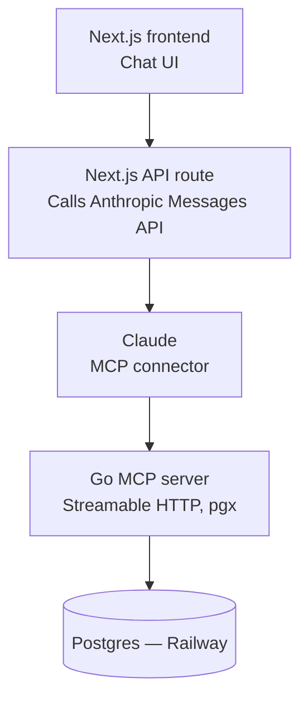

# GoLink

An AI-assisted Sri Lanka EV market explorer. A Go-built MCP server exposing real market data — model specs, price trends, charging infrastructure, and import duty history — to a Next.js chat frontend powered by Claude.

## Why this project

- Real `pgx`/Postgres depth in Go, outside your current job stack.
- A working, deployed example of the Anthropic API's MCP connector — directly relevant to agentic AI roles.
- A genuinely useful personal tool, not a toy CRUD demo.
- A complete story for interviews: frontend, backend, database, and an LLM tool-calling loop, all built and reasoned about by you.

## Architecture



Requests flow down this chain; responses flow back up the same path. The Go server must run with **Streamable HTTP transport** (not stdio) since Claude reaches it over the public internet via the Anthropic API's `mcp_servers` parameter.

## Tech stack

| Layer | Choice |
|---|---|
| MCP server | Go 1.22+, official MCP Go SDK, `pgx/v5` |
| Database | Postgres 16, hosted on Railway |
| Migrations | `golang-migrate` or `goose` |
| Frontend | Next.js (App Router), React |
| LLM integration | Anthropic Messages API, MCP connector (`mcp_servers` param, beta header) |
| Deployment | Railway (Go server + Postgres), Vercel or Railway (frontend) |

## Database schema

```sql
CREATE TABLE ev_models (
    id UUID PRIMARY KEY DEFAULT gen_random_uuid(),
    make VARCHAR(50) NOT NULL,
    model VARCHAR(100) NOT NULL,
    year INT NOT NULL,
    battery_kwh NUMERIC(6,2),
    range_km INT,
    price_lkr_min BIGINT,
    price_lkr_max BIGINT,
    body_type VARCHAR(30),
    import_type VARCHAR(20),
    created_at TIMESTAMPTZ DEFAULT now(),
    updated_at TIMESTAMPTZ DEFAULT now()
);

CREATE TABLE price_listings (
    id UUID PRIMARY KEY DEFAULT gen_random_uuid(),
    model_id UUID REFERENCES ev_models(id) ON DELETE CASCADE,
    source VARCHAR(50),
    price_lkr BIGINT NOT NULL,
    listed_date DATE NOT NULL,
    condition VARCHAR(20),
    mileage_km INT,
    created_at TIMESTAMPTZ DEFAULT now()
);

CREATE TABLE charging_stations (
    id UUID PRIMARY KEY DEFAULT gen_random_uuid(),
    name VARCHAR(100) NOT NULL,
    operator VARCHAR(50),
    location_name VARCHAR(100),
    latitude NUMERIC(9,6),
    longitude NUMERIC(9,6),
    connector_type VARCHAR(30),
    num_chargers INT DEFAULT 1,
    is_fast_charging BOOLEAN DEFAULT false,
    created_at TIMESTAMPTZ DEFAULT now()
);

CREATE TABLE import_policy (
    id UUID PRIMARY KEY DEFAULT gen_random_uuid(),
    effective_date DATE NOT NULL,
    duty_rate_percent NUMERIC(5,2),
    description TEXT,
    created_at TIMESTAMPTZ DEFAULT now()
);
```

## MCP tools

| Tool | Input | Output |
|---|---|---|
| `search_models` | `max_budget_lkr?`, `min_range_km?`, `body_type?`, `import_type?` | Matching models: make, model, year, price range, range |
| `get_model_details` | `make`, `model` | Full spec + summarized price stats (min/avg/max from `price_listings`) |
| `compare_models` | `model_ids[]` (2–3) | Side-by-side spec comparison |
| `get_price_trend` | `model_id`, `months?` | Time series of listings for that model |
| `find_charging_stations` | `near_location?`, `connector_type?`, `fast_charging_only?` | Matching charging stations |
| `get_import_policy` | `as_of_date?` (defaults to latest) | Current/historical duty rate and notes |

Keep every tool **read-only** for v1 — no write operations exposed over MCP until the read path is solid and you've thought through auth.

## Seed data plan (curated, v1)

- **~30–40 real EV models** sold in Sri Lanka (Nissan Leaf, BYD, MG, Tesla, BMW i-series, etc.) with realistic specs and current asking-price ranges, sourced from public dealer listings and forums.
- **10–15 real charging stations** (CEB, Vega, and other known networks) with approximate coordinates.
- **Last 3–5 import policy changes**, with effective dates and duty rates — this is the table that makes the assistant genuinely useful, since duty changes are exactly what people struggle to track.
- Write this as plain SQL `INSERT` seed files, not a script — no scraping in v1.

## Suggested repo structure

```
golink/
  backend/
    cmd/server/main.go
    internal/db/          # pgx connection, queries
    internal/tools/        # one file per MCP tool
    internal/models/       # structs
    migrations/
    go.mod
  frontend/
    app/
    components/
    lib/
  seed/
    ev_models.sql
    charging_stations.sql
    import_policy.sql
  README.md
```

## Build order

1. **Setup** — repo scaffold, Postgres on Railway, migrations tool, Go module with the official MCP Go SDK and `pgx/v5` added.
2. **Seed data** — write and load the curated SQL files.
3. **First tool end-to-end** — `search_models` only, stdio transport, tested locally via Claude Desktop's config. Get one real query working before building the rest.
4. **Remaining tools** — `get_model_details`, `compare_models`, `get_price_trend`, `find_charging_stations`, `get_import_policy`.
5. **Switch to Streamable HTTP** — swap transport, deploy the Go server to Railway, confirm it's publicly reachable.
6. **Frontend** — Next.js chat UI, API route calling the Anthropic Messages API with `mcp_servers` pointing at your deployed server.
7. **Harden** — since the MCP server is now public: add a token/auth check, rate limiting, and a read-only DB role. Always use parameterized queries with `pgx` — never string-concatenate SQL, even for a side project.
8. **Ship it** — README, short writeup, LinkedIn post.

## Stretch goals (v2+)

- Swap curated seed data for a scheduled scraper (riyasewana.com, patpat.lk) feeding `price_listings` for real trend data.
- Containerize the Go server with Docker and write a Kubernetes deployment manifest — doesn't need to be your real deployment target, but it's a natural way to apply CKAD material to a project you already understand deeply.
- Add a write-capable tool (e.g. "save this model to my shortlist") once you've thought through auth properly.
