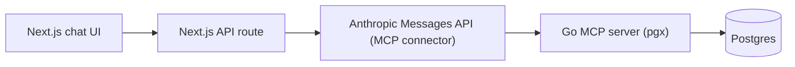

# GoLink — Project Plan

AI-assisted Sri Lanka EV market explorer: a **Go MCP server** over **Postgres**, queried by **Claude**, driven by a **Next.js** chat UI.

Source brief: [GoLink-project-overview.md](GoLink-project-overview.md)

---

## What we're building

A chat app where you ask natural-language questions about Sri Lanka's EV market ("EVs under 15M LKR with 300km+ range", "compare the MG ZS EV and BYD Atto 3", "what's the latest import duty?") and Claude answers by calling read-only tools on our own Go server, which reads a curated Postgres database.

## Architecture



Requests flow down the chain; responses flow back up. Locally we test the Go server over **stdio** (Claude Desktop); in production it runs over **Streamable HTTP** so Claude can reach it over the internet.

## Tech stack

| Layer | Choice |
|---|---|
| MCP server | Go 1.22+, official MCP Go SDK (`github.com/modelcontextprotocol/go-sdk`), `pgx/v5` |
| Database | Postgres 16 (local via Docker; Railway in production) |
| Migrations | goose |
| Frontend | Next.js (App Router), React |
| LLM integration | Anthropic Messages API, MCP connector (`mcp_servers` param + beta header) |
| Deployment | Railway (Go server + Postgres), Vercel (frontend) |

## MCP tools (read-only, v1)

| Tool | Input | Output |
|---|---|---|
| `search_models` | `max_budget_lkr?`, `min_range_km?`, `body_type?`, `import_type?` | Matching models: make, model, year, price range, range |
| `get_model_details` | `make`, `model` | Full spec + price stats (min/avg/max from `price_listings`) |
| `compare_models` | `model_ids[]` (2-3) | Side-by-side spec comparison |
| `get_price_trend` | `model_id`, `months?` | Time series of listings for that model |
| `find_charging_stations` | `near_location?`, `connector_type?`, `fast_charging_only?` | Matching charging stations |
| `get_import_policy` | `as_of_date?` (defaults to latest) | Current/historical duty rate and notes |

## Repo structure

```
GoLink/
  backend/
    cmd/server/main.go
    internal/db/          # pgx connection, queries
    internal/tools/       # one file per MCP tool
    internal/models/      # structs
    migrations/
    go.mod
  frontend/               # added in Phase 7
  seed/
    ev_models.sql
    price_listings.sql
    charging_stations.sql
    import_policy.sql
  docker-compose.yml      # local Postgres
  project.md
  README.md               # added in Phase 9
```

## How we work

Hybrid pace: the boilerplate (scaffold, Docker/Postgres, migrations, seed SQL) is written for me; the high-value Go/MCP code (pgx queries, tool handlers, Anthropic/MCP wiring) we do together — I explain the concept and the shape, you write it, I review. **One phase at a time.**

---

## Build phases

Each phase has: **Do** (the work), **Learn** (concepts), **Done** (definition of done).

### Phase 0 — Prereqs and accounts  `[done]`
- Do: create an [Anthropic API key](https://console.anthropic.com/) and a [Railway account](https://railway.app/); confirm Docker runs.
- Learn: what MCP is; stdio vs Streamable HTTP transport; the Anthropic MCP connector (`mcp_servers` param + beta header).
- Done: API key saved in a gitignored `.env`; Railway login works.

### Phase 1 — Repo scaffold and tooling  `[done]`
- Do: `git init` + `.gitignore`; create `backend/` and `seed/` layout; `go mod init`; add the MCP Go SDK and `pgx/v5`; install goose; start local Postgres in Docker.
- Files: `backend/go.mod`, `backend/cmd/server/main.go` (stub), `.gitignore`, `docker-compose.yml`.
- Learn: Go modules, `cmd/` vs `internal/` layout.
- Done: `go build ./...` compiles the stub; local Postgres reachable.

### Phase 2 — Schema and migrations  `[done]`
- Do: write a goose migration for `ev_models`, `price_listings`, `charging_stations`, `import_policy`; run it against the local DB.
- Files: `backend/migrations/00001_init.sql`.
- Learn: up/down migrations, UUIDs, foreign keys, numeric types.
- Done: all 4 tables exist locally.

### Phase 3 — Seed data  `[done]`
- Do: curate ~30-40 EV models, ~10-15 charging stations, 3-5 import-policy rows, plus `price_listings` rows; write as SQL `INSERT`s; load into the local DB.
- Files: `seed/ev_models.sql`, `seed/price_listings.sql`, `seed/charging_stations.sql`, `seed/import_policy.sql`.
- Learn: referential integrity (listings reference model IDs).
- Done: row counts look right; a sample join returns data.

### Phase 4 — First tool end-to-end: `search_models` over stdio  `[done locally]`  (KEY MILESTONE)
- Do: `pgx` pool connection (`internal/db`); model structs (`internal/models`); implement `search_models` with a parameterized query (`internal/tools`); wire an MCP server over stdio in `main.go`; register it in Claude Desktop; ask a real question.
- Learn: pgx pooling + parameterized queries (`$1, $2`), MCP tool definition (name, input schema, handler), stdio transport, Claude Desktop `mcpServers` config.
- Done: in Claude Desktop, "EVs under 15M LKR with 300km+ range" returns your data.

### Phase 5 — Remaining 5 tools  `[done locally]`
- Do: `get_model_details` (with min/avg/max price stats), `compare_models`, `get_price_trend`, `find_charging_stations`, `get_import_policy`; one file per tool.
- Learn: SQL aggregation, safe `IN` clauses, date filtering, optional/nullable params.
- Done: each tool returns correct data via Claude Desktop.

### Phase 6 — Streamable HTTP and Railway deploy  `[http done, Railway not deployed]`
- Do: swap stdio to Streamable HTTP transport; add `DATABASE_URL` config; provision Railway Postgres; run migrations + seed there; deploy the Go server; verify the public HTTPS URL responds.
- Learn: MCP Streamable HTTP, Railway services/env vars, migrating a remote DB.
- Done: the public URL responds and the server connects to Railway Postgres.

### Phase 7 — Next.js chat frontend  `[not started]`
- Do: scaffold Next.js (App Router); build the chat UI; add an API route that calls the Anthropic Messages API with `mcp_servers` pointing at the Railway URL (+ beta header); stream responses.
- Learn: App Router route handlers, Anthropic SDK, MCP connector wiring, streaming.
- Done: a browser question triggers Claude to call your MCP tools and renders an answer.

### Phase 8 — Harden  `[not started]`
- Do: require an auth token on the MCP server; add basic rate limiting; create and use a read-only Postgres role; audit that every query is parameterized.
- Learn: bearer-token auth on the MCP endpoint, least-privilege DB roles.
- Done: unauthenticated calls are rejected; the app still works under the read-only role.

### Phase 9 — Ship  `[not started]`
- Do: README (architecture, run steps, screenshots), short writeup, LinkedIn post; optional stretch goals (scraper, Docker/K8s, a write-capable tool).
- Done: someone can clone and understand it; you have a shareable link and post.
